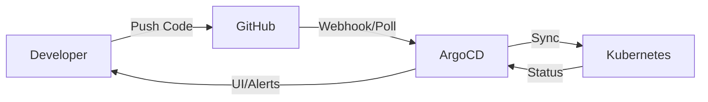

# ArgoCD GitOps Setup

GitOps continuous deployment with ArgoCD for multi-cluster Kubernetes deployments.

## What is ArgoCD?

ArgoCD is a declarative, GitOps continuous delivery tool for Kubernetes:
- **Git as Source of Truth**: Your Git repo defines the desired state
- **Automatic Sync**: Auto-deploys when you push to Git
- **Multi-cluster**: Manage deployments across AWS, DigitalOcean, Azure, etc.
- **Rollback**: Easy rollback to any Git commit
- **UI**: Beautiful web interface to visualize deployments

## Architecture

```
┌─────────────────────────────────────────────────────────┐
│                     GitHub Repository                    │
│  ├── k8s/                                               │
│  │   ├── backend-deployment.yaml                       │
│  │   ├── frontend-deployment.yaml                      │
│  │   └── ...                                           │
│  └── argocd/                                           │
│      └── applications/                                 │
└──────────────────┬──────────────────────────────────────┘
                   │
                   │ (watches for changes)
                   ▼
┌─────────────────────────────────────────────────────────┐
│                    ArgoCD Server                         │
│  ┌──────────────────────────────────────────────────┐  │
│  │ Applications:                                     │  │
│  │  • demo-app-aws (EKS)                            │  │
│  │  • demo-app-digitalocean (DOKS)                  │  │
│  │  • demo-app-dev (Minikube)                       │  │
│  └──────────────────────────────────────────────────┘  │
└──────────────────┬──────────────────────────────────────┘
                   │
         ┌─────────┼─────────┐
         ▼         ▼         ▼
    ┌────────┐ ┌────────┐ ┌────────┐
    │AWS EKS │ │DO DOKS │ │Minikube│
    └────────┘ └────────┘ └────────┘
```

## Installation

### Step 1: Install ArgoCD

```bash
# Run the installation script
cd argocd
chmod +x install.sh
./install.sh

# Or manually:
kubectl create namespace argocd
kubectl apply -n argocd -f https://raw.githubusercontent.com/argoproj/argo-cd/stable/manifests/install.yaml
```

### Step 2: Access ArgoCD UI

```bash
# Port forward
kubectl port-forward svc/argocd-server -n argocd 8080:443

# Open browser
open https://localhost:8080

# Get initial password
kubectl -n argocd get secret argocd-initial-admin-secret -o jsonpath="{.data.password}" | base64 -d
```

Login:
- **Username**: `admin`
- **Password**: (from command above)

### Step 3: Install ArgoCD CLI (Optional)

```bash
# macOS
brew install argocd

# Linux
curl -sSL -o argocd https://github.com/argoproj/argo-cd/releases/latest/download/argocd-linux-amd64
sudo install -m 555 argocd /usr/local/bin/argocd

# Login
argocd login localhost:8080
```

## Deploy Your Application

### Option 1: Single Cluster Deployment

```bash
# Update the Git repo URL in applications/demo-app.yaml
vim applications/demo-app.yaml
# Change: repoURL: https://github.com/YOUR_USERNAME/workshop-day2.git

# Apply the application
kubectl apply -f applications/demo-app.yaml

# Watch deployment in UI or CLI
argocd app get demo-app
argocd app sync demo-app
```

### Option 2: Multi-Cluster Deployment

```bash
# Add additional clusters to ArgoCD
# For AWS EKS
argocd cluster add arn:aws:eks:us-west-2:123456789:cluster/demo-app-prod --name aws-prod

# For DigitalOcean DOKS
argocd cluster add do-nyc1-demo-app-production --name do-prod

# Update applications/demo-app-multi-cluster.yaml with your cluster URLs
vim applications/demo-app-multi-cluster.yaml

# Deploy to all clusters
kubectl apply -f applications/demo-app-multi-cluster.yaml
```

## How It Works

### 1. You Push Code

```bash
# Make changes to Kubernetes manifests
vim k8s/backend-deployment.yaml

# Commit and push
git add .
git commit -m "Update backend to v2.0"
git push
```

### 2. ArgoCD Detects Changes

ArgoCD polls your Git repo every 3 minutes (configurable) or you can set up webhooks for instant deployment.

### 3. ArgoCD Syncs

If `automated.sync` is enabled:
- ArgoCD automatically applies changes to your cluster
- If not enabled, you can manually sync from UI/CLI

### 4. Monitor Deployment

- **UI**: https://localhost:8080
- **CLI**: `argocd app get demo-app`
- **Kubectl**: `kubectl get pods -n demo-app`

## GitOps Workflow



### Development Flow

1. **Develop locally**: `docker-compose up -d`
2. **Build images**: CI/CD builds and pushes to registry
3. **Update manifests**: CI/CD updates image tags in k8s/ folder
4. **Push to Git**: Changes committed to GitHub
5. **ArgoCD deploys**: Auto-sync to clusters
6. **Monitor**: View status in ArgoCD UI

## Application Configuration

### Basic Application

```yaml
apiVersion: argoproj.io/v1alpha1
kind: Application
metadata:
  name: demo-app
  namespace: argocd
spec:
  project: default
  source:
    repoURL: https://github.com/YOUR_USERNAME/workshop-day2.git
    targetRevision: HEAD
    path: k8s
  destination:
    server: https://kubernetes.default.svc
    namespace: demo-app
  syncPolicy:
    automated:
      prune: true      # Delete resources not in Git
      selfHeal: true   # Force sync if cluster differs from Git
```

### Sync Policies

**Automated Sync**:
```yaml
syncPolicy:
  automated:
    prune: true      # Remove resources deleted from Git
    selfHeal: true   # Auto-fix drift from Git state
```

**Manual Sync**:
```yaml
syncPolicy:
  syncOptions:
    - CreateNamespace=true
  # No automated section = manual sync only
```

## Managing Multiple Environments

### Strategy 1: Branches

```yaml
# Production
targetRevision: main

# Staging
targetRevision: staging

# Development
targetRevision: develop
```

### Strategy 2: Kustomize Overlays

```
k8s/
├── base/
│   ├── backend-deployment.yaml
│   └── frontend-deployment.yaml
├── overlays/
│   ├── production/
│   │   └── kustomization.yaml
│   ├── staging/
│   │   └── kustomization.yaml
│   └── dev/
│       └── kustomization.yaml
```

```yaml
# ArgoCD application
source:
  path: k8s/overlays/production
  kustomize: {}
```

### Strategy 3: Helm Values

```yaml
source:
  chart: demo-app
  helm:
    valueFiles:
      - values-production.yaml
```

## CI/CD Integration

### GitHub Actions + ArgoCD

```yaml
# .github/workflows/ci-cd.yaml
- name: Update K8s manifests
  run: |
    sed -i "s|image: .*backend.*|image: registry/backend:${{ github.sha }}|" k8s/backend-deployment.yaml
    git commit -am "Update image tag"
    git push
# ArgoCD automatically deploys!
```

See: `.github/workflows/ci-cd.yaml` for complete example

## Monitoring & Alerts

### Health Status

- **Healthy**: All resources running correctly
- **Progressing**: Deployment in progress
- **Degraded**: Some resources failed
- **Suspended**: Application paused

### Notifications

Configure Slack/Email notifications:

```bash
# Install argocd-notifications
kubectl apply -n argocd -f https://raw.githubusercontent.com/argoproj-labs/argocd-notifications/stable/manifests/install.yaml

# Configure notification template
kubectl apply -f - <<EOF
apiVersion: v1
kind: ConfigMap
metadata:
  name: argocd-notifications-cm
  namespace: argocd
data:
  service.slack: |
    token: $slack-token
  trigger.on-deployed: |
    - when: app.status.operationState.phase in ['Succeeded']
      send: [app-deployed]
EOF
```

## Rollback

### Via UI
1. Go to application
2. Click "History and Rollback"
3. Select previous version
4. Click "Rollback"

### Via CLI
```bash
# View history
argocd app history demo-app

# Rollback to specific revision
argocd app rollback demo-app <revision-id>
```

### Via Git
```bash
# Revert Git commit
git revert HEAD
git push
# ArgoCD auto-deploys the revert
```

## Best Practices

1. **Use Git Tags/Releases**: Tag production releases
2. **Enable Pruning**: Clean up deleted resources
3. **Enable Self-Heal**: Auto-fix drift
4. **Use Projects**: Separate projects for teams/environments
5. **Set Resource Limits**: Prevent resource exhaustion
6. **Monitor Sync Status**: Set up alerts
7. **Use Webhooks**: Faster deployments than polling
8. **Implement RBAC**: Control who can sync what

## Troubleshooting

### Application Won't Sync

```bash
# Check sync status
argocd app get demo-app

# View sync error details
kubectl describe application demo-app -n argocd

# Manual sync with logs
argocd app sync demo-app --prune
```

### Out of Sync

```bash
# See differences
argocd app diff demo-app

# Hard refresh
argocd app get demo-app --hard-refresh

# Force sync
argocd app sync demo-app --force
```

### Health Check Fails

Check resource events:
```bash
kubectl describe pod <pod-name> -n demo-app
kubectl logs <pod-name> -n demo-app
```

## Resources

- **Official Docs**: https://argo-cd.readthedocs.io/
- **Examples**: https://github.com/argoproj/argocd-example-apps
- **Community**: https://argoproj.github.io/community/

## Next Steps

1. ✅ Install ArgoCD
2. ✅ Create applications
3. ✅ Set up GitHub repository
4. ✅ Configure CI/CD pipeline
5. ✅ Deploy to clusters
6. ✅ Monitor deployments
7. ⭐ Add notifications
8. ⭐ Implement progressive delivery

Happy GitOps! 🚀
